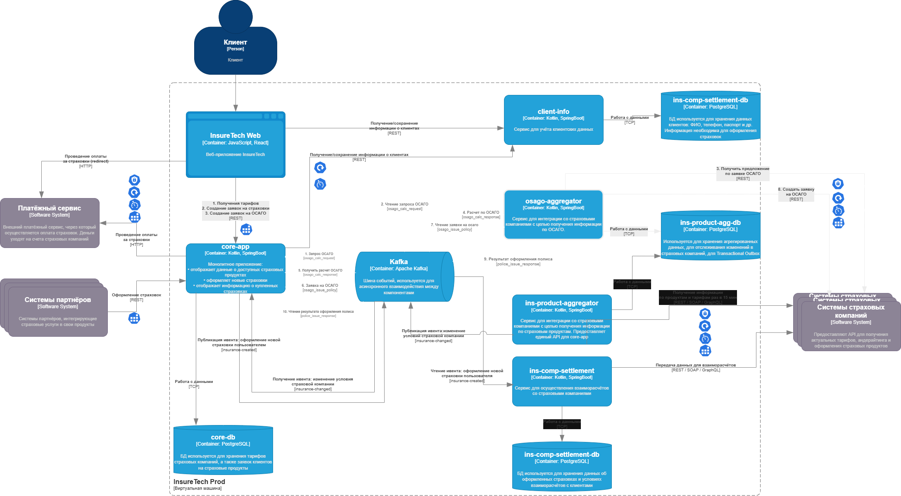

## Архитектурные решения по взаимодействию `core-app` и `osago-aggregator`

### Хранилище данных для `osago-aggregator`

Использовать то же хранилище, что и у ins-product-aggregator.  
Так мы сможем отслеживать изменения в данных страховых компаний без лишних событий и синхронизаций.  
Плюс это даст возможность реализовать **Transactional Outbox** — чтобы не потерять данные при сбоях и избежать дубликатов.  
Ну и, конечно, удобно будет вести аудит изменений страховых планов и тарифов.

В целом, общее хранилище обеспечит согласованность и упростит событийную модель.

---

### `osago-aggregator` API для `core-app`

Взаимодействие `core-app` и `osago-aggregator` выполняется асинхронно через топики Kafka:

| Направление | Имя топика |
| --- | --- |
| Запрос условий | `osago_calc_request` |
| Ответ с условиями | `osago_calc_response` |
| Команда на оформление полиса | `osago_issue_policy` |
| Успешно оформлен полис | `osago_policy_issued` |
| Ошибка оформления | `osago_policy_issue_failed` |

---

### API для веб-приложения

core-app отдаёт наружу обычный REST API.  
Веб-клиент работает по стандартным HTTP-запросам.

---

### Интеграция фронта и core-app

Оставляем REST.  
Решение проверенное, не требует дополнительных слоёв, а клиенту менять ничего не придётся.

---

### Механизмы устойчивости и надёжности

#### Rate Limiting

Ограничиваем число исходящих запросов к страховым компаниям, чтобы не забить их API.  
Заодно ставим лимиты и на входящие запросы от партнёров — чтобы защитить `core-app` от перегрузки.

#### Circuit Breaker

Если внешний сервис лег — временно прекращаем туда ходить.  
Так спасаем систему от лавины ошибок.

#### Retry

При сбое повторяем запрос, но с уникальным идентификатором — чтобы не дублировать данные.

#### Timeout

Лимит ожидания ответа — 60 секунд.  
Если за это время ничего не пришло — возвращаем пользователю ошибку или дефолт.  
То же самое правило действует и внутри нашей системы.

#### Transactional Outbox

В каждом сервисе, где рождаются события, есть таблица `outbox`.  
Сначала пишем туда, потом публикуем.  
Так обеспечиваем at-least-once доставку и устойчивость к сбоям.

---

### Работа при множественных экземплярах сервисов

Так как сервисов несколько, важно:

*   обрабатывать события идемпотентно (по уникальному ключу);
*   синхронизировать данные между инстансами;
*   не плодить дубликаты при повторной доставке.

Такое решение спокойно выдержит горизонтальное масштабирование.

### Схема контейнеров

